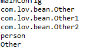
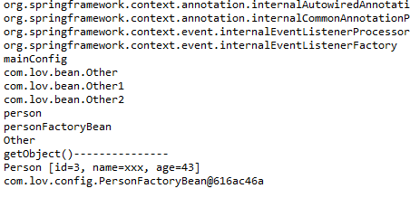

# Spring注解驱动

## 一、容器

### 1、注解加载

​	对于注解式开发，容器的初始化使用的是**AnnotationConfigApplicationContext**的加载类，从**@configuration**配置文件中加载

> **MainConfig.class**

```java
@Configuration
public class MainConfig {
	//id为方法名
	@Bean
	public Person person() {
		return new Person(1,"lov1",22);
	}
}
```

> **SpringRun.class**

```java
public class SpringRun {
	public static void main(String[] args) {
		
//		配置文件式
		/*
		ClassPathXmlApplicationContext application = new ClassPathXmlApplicationContext("bean.xml");
		Person person = application.getBean(Person.class);
		System.out.println(person);
		*/
		
//		注解式
		AnnotationConfigApplicationContext application = new AnnotationConfigApplicationContext(MainConfig.class);
		Person person = (Person) application.getBean("person");
		System.out.println(person);
	}
}
```

### 2、组件注册

```java
@Configuration
@Import({Other.class,MyImportSelector.class,MyImportBeanDefinitionRegistrar.class})
@ComponentScan(
		value="com.lov", //扫描的包
		excludeFilters= {
//			@Filter(Controller.class),
//			@Filter(type=FilterType.ASSIGNABLE_TYPE,classes= {PersonService.class})
			@Filter(type=FilterType.CUSTOM,classes= {MyTypeFilter.class})
		}	
		//如果要使用includeFilters，必须将useDefaultFilters设置为false
		) //过滤排除
public class MainConfig {
    	//id为方法名
//	@Lazy
//	@Scope("prototype")
	@Bean
	public Person person() {
		return new Person(1,"lov1",22);
	}
	
	@Conditional(HasPersonCondition.class)
	@Bean
	public Person lovPerson() {
		return new Person(2,"lov",33);
	}
    
    @Bean
	public PersonFactoryBean personFactoryBean() {
		return new PersonFactoryBean();
	}
}
```

#### @ComponentScan

​	扫描指定包下组件

**excludeFilters => filter => filterType.class**

```java
public enum FilterType {
	ANNOTATION,		//根据给定注解类过滤
	ASSIGNABLE_TYPE,//根据给定类型过滤
	ASPECTJ,		//根据切面匹配的表达式过滤
	REGEX,			//根据正则
	CUSTOM			//根据自定义的filtertype类过滤
}
----------------------------------------------------

    MyTypeFilter：自定义FilterType
public class MyTypeFilter implements TypeFilter{
	/**
	 * @param metadataReader 目标class元数据reader
	 * @param metadataReaderFactory 得到其他class元数据的reader的factory
	 * @return whether this filter matches
	 * 
	 */
	@Override
	public boolean match(MetadataReader metadataReader, MetadataReaderFactory metadataReaderFactory)
			throws IOException {
		String className = metadataReader.getClassMetadata().getClassName();
		System.out.println("--->"+className);
		if (className.contains("er")) {
			return true;
		}
		return false;
	}
}
```

```java
console：
--->com.lov.test.AnnotaitonTest	//扫描com.lov下所有类
--->com.lov.SpringRun
--->com.lov.bean.Person
--->com.lov.config.MyTypeFilter
--->com.lov.controller.PersonController
--->com.lov.dao.PersonDao
--->com.lov.service.PersonService
//容器自动注入的类
org.springframework.context.annotation.internalConfigurationAnnotationProcessor
org.springframework.context.annotation.internalAutowiredAnnotationProcessor
org.springframework.context.annotation.internalCommonAnnotationProcessor
org.springframework.context.event.internalEventListenerProcessor
org.springframework.context.event.internalEventListenerFactory
//filter className.contains("er") 及 配置注入的类
mainConfig //@Configuration实质为@Component注解，main加载的配置类
person	//@Configuration注解的mainConfig类中通过@bean注入的
```

#### @Scope

```java
	@Scope("prototype")
	@Bean
	public Person person() {
		return new Person(1,"lov1",22);
	}
---------------------------------------------------
Scope:
    /**
	 * Specifies the name of the scope to use for the annotated component/bean.
	 * <p>Defaults to an empty string ({@code ""}) which implies
	 * {@link ConfigurableBeanFactory#SCOPE_SINGLETON SCOPE_SINGLETON}.
	 * @since 4.2
	 * @see ConfigurableBeanFactory#SCOPE_PROTOTYPE prototype 调用对象才创建
	 * @see ConfigurableBeanFactory#SCOPE_SINGLETON singleton 容器初始化创建
	 * @see org.springframework.web.context.WebApplicationContext#SCOPE_REQUEST request
	 * @see org.springframework.web.context.WebApplicationContext#SCOPE_SESSION session
	 * @see #value
	 */
	@AliasFor("value")
	String scopeName() default "";
```

#### @Lazy

```java
	@Lazy //第一次使用才创建
	@Bean
	public Person person() {
		return new Person(1,"lov1",22);
	}
```

#### @Conditional

```java
@Conditional(HasPersonCondition.class) //判断当存在Person类，则不注入该实例
	@Bean
	public Person lovPerson() {
		return new Person(2,"lov",33);
	}
--------------------------------------------------
 HasPersonCondition:
public class HasPersonCondition implements Condition {
	/*
	 * @param context 判断条件使用的context
	 * @param metadata	注解类型信息
	 * (non-Javadoc)
	 */
	@Override
	public boolean matches(ConditionContext context, AnnotatedTypeMetadata metadata) {
		ConfigurableListableBeanFactory beanFactory = context.getBeanFactory();
		Person bean = beanFactory.getBean(Person.class);
		if (bean == null) {
			return true;
        }
		return false;
	}

}

```

#### @Import

>  为容器中注入 组件：
>
> ​	1、包扫描
>
> ​	2、@bean
>
> ​	3、@Import 
>
> ​	4、Spring提供的FactoryBean 
>
> 	@Target(ElementType.TYPE)
> 	@Retention(RetentionPolicy.RUNTIME)
> 	@Documented
> 	public @interface Import {
> 	/**
> 	 * {@link Configuration}, {@link ImportSelector}, {@link ImportBeanDefinitionRegistrar}
> 	 * or regular component classes to import.
> 	 */
> 		Class<?>[] value();
> 	}
>

```java
@Import({Other.class,MyImportSelector.class，MyImportBeanDefinitionRegistrar.class})

Other.class：通过import直接导入，id为导入类的全类名	
MyImportSelector.class：导入该类，注入时执行内部方法，id为导入类的全类名
MyImportBeanDefinitionRegistrar.class：导入该类，注入时执行内部方法，id自定义
-----------------------------------------------------
MyImportSelector：
public class MyImportSelector implements ImportSelector{
	/*
	 * 返回导入容器的组件全类名
	 * importingClassMetadata：当前@import标注类的注解信息
	 */
	@Override
	public String[] selectImports(AnnotationMetadata importingClassMetadata) {
		return new String[] {"com.lov.bean.Other1","com.lov.bean.Other2"};
	}
}
-----------------------------------------------------
MyImportBeanDefinitionRegistrar:
public class MyImportBeanDefinitionRegistrar implements ImportBeanDefinitionRegistrar{
	/*
	 * importingClassMetadata：当前类的注解信息
	 * registry：BeanDefinition注册类，把所有需要添加到容器中的bean，调用BeanDefinitionRegistry。registerBeanDefinition手动注册
	 */
	@Override
	public void registerBeanDefinitions(AnnotationMetadata importingClassMetadata, BeanDefinitionRegistry registry) {
		BeanDefinition beanDefinition =new RootBeanDefinition(Other.class);
		registry.registerBeanDefinition("Other", beanDefinition );	
	}
}
```



#### FactoryBean

```java
默认获取到的是工厂bean调用getObject创建的对象
要获取工厂bean本身，需要在id前加&
------------------------------------------------
 PersonFactoryBean：
public class PersonFactoryBean  implements FactoryBean<Person>{

	@Override
	public Person getObject() throws Exception {
		System.out.println("getObject()---------------");
		return new Person(3,"xxx",43);
	}

	@Override
	public Class<?> getObjectType() {
		return Person.class;
	}
	
}
----------------------------------------------------
Test:
@Test
	public void test2() {
		String[] beanDefinitionNames = applicaiton.getBeanDefinitionNames();
		Arrays.asList(beanDefinitionNames).forEach((item)->System.out.println(item));
		System.out.println(applicaiton.getBean("personFactoryBean"));
		System.out.println(applicaiton.getBean("&personFactoryBean"));
	}	

```



### 3、生命周期

### 4、组件赋值

### 5、组件注入

### 6、AOP

### 7、声明式事物	

## 二、扩展原理

### 1、BenaFactoryPostProcessor

### 2、BeanDefinitionRegistryPostProcessor

### 3、ApplicationListener

### 4、Spring容器创建过程

## 三、web

### 1、servlet3.0

### 2、异步请求