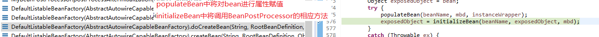

# Spring注解驱动

## 一、容器

### 1、注解加载

​	对于注解式开发，容器的初始化使用的是**AnnotationConfigApplicationContext**的加载类，从**@configuration**配置文件中加载

> **MainConfig.class**

```java
@Configuration
public class MainConfig {
	//id为方法名
	@Bean
	public Person person() {
		return new Person(1,"lov1",22);
	}
}
```

> **SpringRun.class**

```java
public class SpringRun {
	public static void main(String[] args) {
		
//		配置文件式
		/*
		ClassPathXmlApplicationContext application = new ClassPathXmlApplicationContext("bean.xml");
		Person person = application.getBean(Person.class);
		System.out.println(person);
		*/
		
//		注解式
		AnnotationConfigApplicationContext application = new AnnotationConfigApplicationContext(MainConfig.class);
		Person person = (Person) application.getBean("person");
		System.out.println(person);
	}
}
```

### 2、组件注册

```java
@Configuration
@Import({Other.class,MyImportSelector.class,MyImportBeanDefinitionRegistrar.class})
@ComponentScan(
		value="com.lov", //扫描的包
		excludeFilters= {
//			@Filter(Controller.class),
//			@Filter(type=FilterType.ASSIGNABLE_TYPE,classes= {PersonService.class})
			@Filter(type=FilterType.CUSTOM,classes= {MyTypeFilter.class})
		}	
		//如果要使用includeFilters，必须将useDefaultFilters设置为false
		) //过滤排除
public class MainConfig {
    	//id为方法名
//	@Lazy
//	@Scope("prototype")
	@Bean
	public Person person() {
		return new Person(1,"lov1",22);
	}
	
	@Conditional(HasPersonCondition.class)
	@Bean
	public Person lovPerson() {
		return new Person(2,"lov",33);
	}
    
    @Bean
	public PersonFactoryBean personFactoryBean() {
		return new PersonFactoryBean();
	}
}
```

#### @ComponentScan

​	扫描指定包下组件

**excludeFilters => filter => filterType.class**

```java
public enum FilterType {
	ANNOTATION,		//根据给定注解类过滤
	ASSIGNABLE_TYPE,//根据给定类型过滤
	ASPECTJ,		//根据切面匹配的表达式过滤
	REGEX,			//根据正则
	CUSTOM			//根据自定义的filtertype类过滤
}
----------------------------------------------------

    MyTypeFilter：自定义FilterType
public class MyTypeFilter implements TypeFilter{
	/**
	 * @param metadataReader 目标class元数据reader
	 * @param metadataReaderFactory 得到其他class元数据的reader的factory
	 * @return whether this filter matches
	 * 
	 */
	@Override
	public boolean match(MetadataReader metadataReader, MetadataReaderFactory metadataReaderFactory)
			throws IOException {
		String className = metadataReader.getClassMetadata().getClassName();
		System.out.println("--->"+className);
		if (className.contains("er")) {
			return true;
		}
		return false;
	}
}
```

```java
console：
--->com.lov.test.AnnotaitonTest	//扫描com.lov下所有类
--->com.lov.SpringRun
--->com.lov.bean.Person
--->com.lov.config.MyTypeFilter
--->com.lov.controller.PersonController
--->com.lov.dao.PersonDao
--->com.lov.service.PersonService
//容器自动注入的类
org.springframework.context.annotation.internalConfigurationAnnotationProcessor
org.springframework.context.annotation.internalAutowiredAnnotationProcessor
org.springframework.context.annotation.internalCommonAnnotationProcessor
org.springframework.context.event.internalEventListenerProcessor
org.springframework.context.event.internalEventListenerFactory
//filter className.contains("er") 及 配置注入的类
mainConfig //@Configuration实质为@Component注解，main加载的配置类
person	//@Configuration注解的mainConfig类中通过@bean注入的
```

#### @Scope

```java
	@Scope("prototype")
	@Bean
	public Person person() {
		return new Person(1,"lov1",22);
	}
---------------------------------------------------
Scope:
    /**
	 * Specifies the name of the scope to use for the annotated component/bean.
	 * <p>Defaults to an empty string ({@code ""}) which implies
	 * {@link ConfigurableBeanFactory#SCOPE_SINGLETON SCOPE_SINGLETON}.
	 * @since 4.2
	 * @see ConfigurableBeanFactory#SCOPE_PROTOTYPE prototype 调用对象才创建
	 * @see ConfigurableBeanFactory#SCOPE_SINGLETON singleton 容器初始化创建
	 * @see org.springframework.web.context.WebApplicationContext#SCOPE_REQUEST request
	 * @see org.springframework.web.context.WebApplicationContext#SCOPE_SESSION session
	 * @see #value
	 */
	@AliasFor("value")
	String scopeName() default "";
```

#### @Lazy

```java
	@Lazy //第一次使用才创建
	@Bean
	public Person person() {
		return new Person(1,"lov1",22);
	}
```

#### @Conditional

```java
@Conditional(HasPersonCondition.class) //判断当存在Person类，则不注入该实例
	@Bean
	public Person lovPerson() {
		return new Person(2,"lov",33);
	}
--------------------------------------------------
 HasPersonCondition:
public class HasPersonCondition implements Condition {
	/*
	 * @param context 判断条件使用的context
	 * @param metadata	注解类型信息
	 * (non-Javadoc)
	 */
	@Override
	public boolean matches(ConditionContext context, AnnotatedTypeMetadata metadata) {
		ConfigurableListableBeanFactory beanFactory = context.getBeanFactory();
		Person bean = beanFactory.getBean(Person.class);
		if (bean == null) {
			return true;
        }
		return false;
	}

}

```

#### @Import

>  为容器中注入 组件：
>
> ​	1、包扫描
>
> ​	2、@bean
>
> ​	3、@Import 
>
> ​	4、Spring提供的FactoryBean 
>
> 	@Target(ElementType.TYPE)
> 	@Retention(RetentionPolicy.RUNTIME)
> 	@Documented
> 	public @interface Import {
> 	/**
> 	 * {@link Configuration}, {@link ImportSelector}, {@link ImportBeanDefinitionRegistrar}
> 	 * or regular component classes to import.
> 	 */
> 		Class<?>[] value();
> 	}
>

```java
@Import({Other.class,MyImportSelector.class，MyImportBeanDefinitionRegistrar.class})

Other.class：通过import直接导入，id为导入类的全类名	
MyImportSelector.class：导入该类，注入时执行内部方法，id为导入类的全类名
MyImportBeanDefinitionRegistrar.class：导入该类，注入时执行内部方法，id自定义
-----------------------------------------------------
MyImportSelector：
public class MyImportSelector implements ImportSelector{
	/*
	 * 返回导入容器的组件全类名
	 * importingClassMetadata：当前@import标注类的注解信息
	 */
	@Override
	public String[] selectImports(AnnotationMetadata importingClassMetadata) {
		return new String[] {"com.lov.bean.Other1","com.lov.bean.Other2"};
	}
}
-----------------------------------------------------
MyImportBeanDefinitionRegistrar:
public class MyImportBeanDefinitionRegistrar implements ImportBeanDefinitionRegistrar{
	/*
	 * importingClassMetadata：当前类的注解信息
	 * registry：BeanDefinition注册类，把所有需要添加到容器中的bean，调用BeanDefinitionRegistry。registerBeanDefinition手动注册
	 */
	@Override
	public void registerBeanDefinitions(AnnotationMetadata importingClassMetadata, BeanDefinitionRegistry registry) {
		BeanDefinition beanDefinition =new RootBeanDefinition(Other.class);
		registry.registerBeanDefinition("Other", beanDefinition );	
	}
}
```


#### FactoryBean

```java
默认获取到的是工厂bean调用getObject创建的对象
要获取工厂bean本身，需要在id前加&
------------------------------------------------
 PersonFactoryBean：
public class PersonFactoryBean  implements FactoryBean<Person>{

	@Override
	public Person getObject() throws Exception {
		System.out.println("getObject()---------------");
		return new Person(3,"xxx",43);
	}

	@Override
	public Class<?> getObjectType() {
		return Person.class;
	}
	
}
----------------------------------------------------
Test:
@Test
	public void test2() {
		String[] beanDefinitionNames = applicaiton.getBeanDefinitionNames();
		Arrays.asList(beanDefinitionNames).forEach((item)->System.out.println(item));
		System.out.println(applicaiton.getBean("personFactoryBean"));
		System.out.println(applicaiton.getBean("&personFactoryBean"));
	}	

```


### 3、生命周期

#### bean的生命周期

> bean创建，初始化，销毁
>
> 容器管理bean的生命周期：可以自定义初始化和销毁方法，容器在bean进行到生命周期的时候调用自定义的初始化与销毁方法

1、指定初始化与销毁方法

```java
MainConfigLifeCycle:
@Configuration
public class MainConfigLifeCycle {
	//指定inieMethod与destroyMethod
    //在销毁时：单例在容器关闭时被销毁；对于原型，容器不会管理该bean
	@Bean(initMethod="init",destroyMethod="destroy")
	public Person lov() {
		return new Person(1,"lov",23);
	}
	
}
-----------------------------------------
Person:
	
	public void init() {
		System.out.println("init----------");
		
	}
	
	public void destroy() {
		System.out.println("destroy--------");
	}

```

2、让bean实现InitializingBean与DisposableBean

```java
Man:
public class Man implements InitializingBean,DisposableBean{
	@Override
	public void destroy() throws Exception {
		System.out.println("destroy----------------");	
	}
	@Override
	public void afterPropertiesSet() throws Exception {
	System.out.println("afterPropertiesSet----------------");	
	}	
}
-------------------------------------------
MainConfigLifeCycle:
    @Bean
	public Man man() {
		return new Man();
	}
```

3、JSR250：@PostConstruct，@PreDestroy

```java
Woman:
public class Woman {
	@PostConstruct //在bean创建完成并且属性赋值完成，在执行初始化方法
	public void init() {
		System.out.println("woman_init----------");
	}	
	@PreDestroy	//在容器销毁bean之前通知进行清理工作
	public void destroy() {
		System.out.println("woman_destroy-----------");
	}
}
---------------------------------------
 MainConfigLifeCycle:
    @Bean
	public Woman woman() {
		return new Woman();
	}
```

4、BeanPostProcessor

```java
@Component
public class MyBeanPostProcessor implements BeanPostProcessor {
	
	@Override//bean的初始化调用前执行
	public Object postProcessBeforeInitialization(Object bean, String beanName) throws BeansException {
		System.out.println("postProcessBeforeInitialization");
		return bean;
	}

	@Override //bean初始化调用后执行
	public Object postProcessAfterInitialization(Object bean, String beanName) throws BeansException {
		System.out.println("postProcessAfterInitialization");
		return bean;
	}
}
```

#### BeanPostProcessor

##### 原理

> 在bean的属性赋值后，调用before，在调用bean的init，最后after

**1、DefaultListableBeanFactory(AbstractAutowireCapableBeanFactory).doCreateBean(String, RootBeanDefinition, Object[])** 



**2、DefaultListableBeanFactory(AbstractAutowireCapableBeanFactory).initializeBean(String, Object, RootBeanDefinition)** 


**3、DefaultListableBeanFactory(AbstractAutowireCapableBeanFactory).applyBeanPostProcessorsBeforeInitialization(Object, String)** 


##### Spring底层使用

> bean赋值，注入其他组件；如：@Autowired，@Prepost......


### 4、组件赋值

#### @Value

```java
Person:
public class Person {
	@Value("#{T(java.lang.Math).random()*10}")
	private Integer id;
	@Value("lov")
    //@Value("${lov.name}") 
	private String name;
   	
	@Value("#{20+4}")
	private Integer age;
----------------------------------------------
    1、基本数值
    2、SqlEl，#{}
    3、${}，取出配置文件中的值（在运行变量里的值）
----------------------------------------------
MyConfigPropertyValue:
        //使用@PropertySource读取外部配置文件中的k/v值保存到运行的环境变量中；加载完外部的配置文件后使用${}取值
@PropertySource(value= {"classpath:/person.properties"})
@Configuration
public class MyConfigPropertyValue {
	@Bean
	public Person person() {
		return new Person();
	}
}
```

### 5、组件注入

#### @Autowired

​	由**AutowiredAnnotationBeanPostProcessor**解析执行

> **1**、默认优先按照类型去容器中找对应的组件

> **2**、如果找到多个相同类型的组件，再将属性的名称作为组件的id去容器中查找

> **3**、@Qualifier：使用该注解指定需要装配的组件的id，而不使用属性名

> **4**、自动装配默认一定要将属性赋值，否则报错，required=false取消

> **5**、@Primary：让Spring进行自动装配的时候、默认使用首选的bean、也可以继续使用@Qualifier指定需要装配的 bean

```java
PersonService:
@Service
public class PersonService {

	@Autowired
	PersonDao dao1;
	
	@Qualifier("dao")
	@Autowired
	PersonDao dao;
	
	@Qualifier("dao2")
	@Autowired(required=false)
	PersonDao dao2;
	
	public void test() {
		System.out.println("@Autowired"+dao1);
		System.out.println("@qualifier"+dao);
		System.out.println("@Autowired(required=false)"+dao2);
	}	
}
------------------------------------------
MainConfigAutowired:
	@Bean
	public PersonService service() {
		return new PersonService();
	}	
	@Bean
	public PersonDao dao() {
		return new PersonDao();
	}
	@Primary
	@Bean
	public PersonDao dao1() {
		return new PersonDao();
	}
------------------------------------------
Test:
	@Test
	public void test5() {	
		AnnotationConfigApplicationContext applicationContext = new AnnotationConfigApplicationContext(MainConfigAutowired.class);
	System.out.println("dao"+applicationContext.getBean("dao"));
		System.out.println("dao1"+applicationContext.getBean("dao1"));
				applicationContext.getBean(PersonService.class).test();		
	}
```

> dao    :     com.lov.dao.PersonDao@560348e6
> dao1  :	com.lov.dao.PersonDao@1df8b5b8
> @Autowired	:com.lov.dao.PersonDao@1df8b5b8
> @qualifier:	com.lov.dao.PersonDao@560348e6
> @Autowired(required=false):	null

​	**@Autowired可用在构造器，参数，方法，属性**

> **构造器**：如果只有一个有参构造器，这个有参构造器的@Autowired可以省略；自动注入的是构造器的参数

> **方法**：@Bean+方法参数；参数自动注入；默认可以不写@Autowired

#### @Resource、@Inject

> **@Resource（JSR250）**：和@Autowired一样实现自动装配功能，默认时按照组件名称进行装配；不能支持@Primary和required

> **@Inject（JSR330）**：需要导入javax.inject包，和@Autowired功能一样，没有required
>
> ```java
> <!-- https://mvnrepository.com/artifact/javax.inject/javax.inject -->
> <dependency>
>     <groupId>javax.inject</groupId>
>     <artifactId>javax.inject</artifactId>
>     <version>1</version>
> </dependency>
> ```

#### Spring底层组件

> 自定义组件要使用Spring容器底层的一些组件，
>
> 自定义组件需**实现xxxAware**：在创建对象是，会调用接口规定的方法注入相关组件；
>
> **Aware**：把Spring底层一些组件注入到自定义的Bean中
>
> 对于**xxxAware**，都有对应的**xxxProcessor**处理

```java
public class Person implements ApplicationContextAware,EnvironmentAware,EmbeddedValueResolverAware{
    .............
    @Override
	public void setEmbeddedValueResolver(StringValueResolver resolver) {
		System.out.println(resolver.resolveStringValue("os_name:${os.name},num:#{1+23}"));
	}

	@Override
	public void setEnvironment(Environment environment) {
		System.out.println(environment.getClass());
	}

	@Override
	public void setApplicationContext(ApplicationContext applicationContext) throws BeansException {
		System.out.println(applicationContext.getBean("person"));
	}
```


#### @Profile

> 指定组件在哪个环境下被注入到容器，不指定的默认都注入
>
> 1、加了环境标识的bean，只有在该环境下才被注入。默认是default环境
>
> 2、写在配置类上，影响整个配置

```java
MainConfigProfile:
//@Profile("test")
@PropertySource(value= {"classpath:/db.properties"})
@Configuration
public class MainConfigProfile {

	@Value("${name}")
	String Name;
	@Value("${password}")
	String password;
	@Value("${driver}")
	String driver;
	@Value("${url}")
	String dburl;
	
	
	@Bean
	public DruidDataSource dataSourceTEST() {
		DruidDataSource druidDataSource = new DruidDataSource();
		
		druidDataSource.setName(Name);
		druidDataSource.setPassword(password);
		druidDataSource.setDriverClassName(driver);
		druidDataSource.setUrl(dburl);
		
		return druidDataSource;
	}
	@Profile("dev")
	@Bean
	public DruidDataSource dataSourceDEV() {
		DruidDataSource druidDataSource = new DruidDataSource();
		
		druidDataSource.setName(Name);
		druidDataSource.setPassword(password);
		druidDataSource.setDriverClassName(driver);
		druidDataSource.setUrl(dburl);
		
		return druidDataSource;
	}
	@Profile("prd")
	@Bean
	public DruidDataSource dataSourcePRD() {
		DruidDataSource druidDataSource = new DruidDataSource();
		
		druidDataSource.setName(Name);
		druidDataSource.setPassword(password);
		druidDataSource.setDriverClassName(driver);
		druidDataSource.setUrl(dburl);
		
		return druidDataSource;
	}	
}
--------------------------------------------
测试：
1、命令行动态参数：虚拟机参数-Dspring.profiles.active=test
2、代码：通过无参构造器，及手动实现有参构造器中方法
@Test
	public void test6() {
		//使用无参构造器
		AnnotationConfigApplicationContext applicationContext = new AnnotationConfigApplicationContext();
		//设置profile
		applicationContext.getEnvironment().setActiveProfiles("test","dev");
		//注册配置类
		applicationContext.register(MainConfigProfile.class);
		//刷新
		applicationContext.refresh();
		
		String[] beanDefinitionNames = applicationContext.getBeanDefinitionNames();
		for (String string : beanDefinitionNames) {
			if (string.contains("dataSource")) {
				System.out.println(((DruidDataSource)applicationContext.getBean(string)).getName());;
				System.out.println(string);
			}
		}
	}
```

### 6、AOP

#### 步骤

> 1、导入aop模块
>
> 2、定义业务逻辑类
>
> 3、定义日志切面类
>
> ​	通知方法：
>
> ​	前置通知：（@Before）
>
> ​	后置通知：（@After）
>
> ​	返回通知：（@AfterReturning）
>
> ​	异常通知：（@AfterThrowing）
>
> ​	环绕通知：（@Around）
>
> 4、给切面类的目标方法标注通知注解
>
> 5、将切面类与业务逻辑类都加入容器
>
> 6、切面类添加@Aspect
>
> 7、配置类添加@EnableAspectJAutoProxy

**总结：**

> 1、将业务逻辑组件与切面类都加到容器中；告诉Spring哪个是切面类（@Aspect）
>
> 2、在切面类上的每一个通知方法上标注通知注解；告诉Spring何时运行（切入点表达式）
>
> 3、开启基于注解的aop模式：@EnableAspectJAutoProxy

**Calculator**:

```java
public class Calculator {

	public int div(int i,int j) {
		System.out.println("div执行");
		return i/j;
	}
	
}
```

**LogAspects**:

```java
@Aspect
public class LogAspects {

	//抽取公共的切入点表达式
	//1、本类引用 :pointCut()
	//2、其他切面引用:com.lov.aop.LogAspects.poincut()
	@Pointcut("execution(public int com.lov.aop.Calculator.*(..))")
	public void pointcut() {};
	
	@Before("pointcut()")
	//JoinPoint参数必须是第一个参数
	public void logStart(JoinPoint joinPoint) {
		
		System.out.println("logStart-------->"+Arrays.asList(joinPoint.getArgs()).toString());
	}
	@After("pointcut()")
	public void logEnd(JoinPoint joinPoint) {
		System.out.println("logEnd-------->"+joinPoint.getSignature().getName());
	}
	@AfterReturning(value="pointcut()",returning="result")
	public void logReturn(Object result) {
		System.out.println("logReturn-------->"+result);
	}
	@AfterThrowing(value="pointcut()",throwing="exception")
	public void logException(Exception exception) {
		
		System.out.println("logException-------->"+exception);
	}
//	@Around("pointcut()")
	public void logAround() {
		System.out.println("logAround-------->");
	}
	
}
```

**MainConfigAop**:

```java
@EnableAspectJAutoProxy
@Configuration
public class MainConfigAop {

	//业务逻辑类加入到容器中
	@Bean
	public Calculator calculator() {
		return new Calculator();
	}
	
	//切面类加入到容器中
	@Bean
	public LogAspects logAspects() {
		return new LogAspects();
	}
	
}
```

**Test**:

```java
@Test
	public void test7() {
		
		
		AnnotationConfigApplicationContext applicationContext = new AnnotationConfigApplicationContext(MainConfigAop.class);
		Calculator bean = applicationContext.getBean(Calculator.class);
		
		System.out.println(bean.div(3,3));
	}
```

**result**:

```java
logStart-------->[3, 3]
div执行
logEnd-------->div
logReturn-------->1
1
```


### 7、声明式事物	

## 二、扩展原理

### 1、BenaFactoryPostProcessor

### 2、BeanDefinitionRegistryPostProcessor

### 3、ApplicationListener

### 4、Spring容器创建过程

## 三、web

### 1、servlet3.0

### 2、异步请求